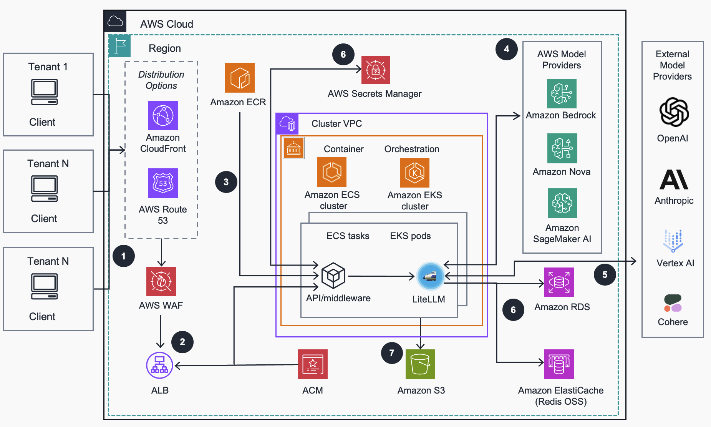

# LLM Gateway - LiteLLM na AWS

## Índice

- [Visão Geral do Projeto](#visão-geral-do-projeto)
- [Arquitetura](#arquitetura)
- [Custo](#custo)  
   - [Tabelas de Custo de Exemplo](#tabelas-de-custo-de-exemplo)
- [Segurança](#segurança)
- [Como Implantar](#como-implantar)
- [Avisos](#avisos)

## Visão Geral do Projeto

Este projeto fornece uma implantação simples do Terraform do [LiteLLM](https://github.com/BerriAI/litellm) na plataforma Amazon Elastic Kubernetes Service (EKS) na AWS (o código para a plataforma Elastic Container Service ECS está em fase de testes). Ele visa ser pré-configurado com padrões que permitirão à maioria dos usuários começar rapidamente com o LiteLLM.  Essa implementação tomou como base o [Guidance for Multi-Provider Generative AI Gateway on AWS](https://aws-solutions-library-samples.github.io/ai-ml/guidance-for-multi-provider-generative-ai-gateway-on-aws.html) e é uma simplificação daquele projeto.

Ele também fornece recursos adicionais além do LiteLLM, como uma Interface AWS Bedrock (em vez da interface OpenAI padrão), suporte para AWS Bedrock Managed Prompts, Histórico de Chat e suporte para Autenticação de Token JWT Okta Oauth 2.0.

O LiteLLM fornece uma interface consistente para acessar todos os provedores de LLM, para que você não precise editar seu código para experimentar diferentes modelos. Ele permite gerenciar centralmente e rastrear o uso de LLM em sua empresa no nível de usuário, equipe e chave de API. Você pode configurar orçamentos e limites de taxa, restringir o acesso a modelos específicos e configurar lógica de roteamento de retry/fallback em vários provedores. Ele fornece medidas de economia de custos como cache de prompts. Ele fornece recursos de segurança como suporte para AWS Bedrock Guardrails para todos os provedores de LLM. Finalmente, ele fornece uma UI onde os administradores podem configurar seus usuários e equipes, e os usuários podem gerar suas chaves de API e testar diferentes LLMs em uma interface de chat.

## Arquitetura



### Etapas da arquitetura

1. Usuários e aplicações cliente acessam a API proxy do gateway LiteLLM com endereço registrado em um serviço de DNS, o qual pode ser o [Amazon Route 53](https://aws.amazon.com/route53/). Há possibilidade de uso de uma distribuição do [Amazon CloudFront](https://aws.amazon.com/cloudfront/), que é protegida contra exploits web comuns e bots usando [AWS Web Application Firewall (WAF)](https://aws.amazon.com/waf/).
2. O AWS WAF encaminha solicitações para o [Application Load Balancer (ALB)](https://aws.amazon.com/elasticloadbalancing/application-load-balancer/) para distribuir automaticamente o tráfego de aplicação de entrada para tarefas do [Amazon Elastic Container Service (ECS)](https://aws.amazon.com/ecs/) ou pods do [Amazon Elastic Kubernetes Service (EKS)](https://aws.amazon.com/eks/) executando contêineres de gateway de IA generativa. A criptografia TLS/SSL protege o tráfego usando um certificado emitido pelo [AWS Certificate Manager (ACM)](https://aws.amazon.com/certificate-manager/).
3. Imagens de contêiner para aplicações API/middleware e LiteLLM são construídas durante a implantação e enviadas para o [Amazon Elastic Container Registry (ECR)](http://aws.amazon.com/ecr/). Elas são usadas para implantação no Amazon ECS no AWS Fargate ou clusters Amazon EKS que executam essas aplicações como contêineres em tarefas ECS ou pods EKS, respectivamente. O LiteLLM fornece uma interface de aplicação unificada para configuração e interação com provedores de LLM. A API/middleware integra nativamente com o [Amazon Bedrock](https://aws.amazon.com/bedrock/) para habilitar recursos não suportados pelo [projeto de código aberto LiteLLM](https://docs.litellm.ai/).
4. Modelos hospedados no [Amazon Bedrock](https://aws.amazon.com/bedrock/) e [Amazon Nova](https://aws.amazon.com/ai/generative-ai/nova/) fornecem acesso a modelos, guardrails, cache de prompts e roteamento para aprimorar o gateway de IA e controles adicionais para clientes através de uma API unificada. O acesso a modelos também está disponível para modelos implantados no [Amazon SageMaker AI](https://aws.amazon.com/sagemaker-ai/). [O acesso aos modelos Amazon Bedrock necessários](https://docs.aws.amazon.com/bedrock/latest/userguide/model-access-modify.html) deve ser configurado adequadamente.
5. Provedores de modelos externos (como OpenAI, Anthropic ou Vertex AI) são configurados usando a UI Admin do LiteLLM para habilitar acesso adicional a modelos através da interface de aplicação unificada do LiteLLM. Integre configurações pré-existentes de provedores terceirizados no gateway usando APIs do LiteLLM.
6. O LiteLLM integra com os serviços [Amazon ElastiCache (Redis OSS)](https://aws.amazon.com/elasticache/), [Amazon Relational Database Service (RDS)](https://aws.amazon.com/rds/) e [AWS Secrets Manager](https://aws.amazon.com/secrets-manager/). O Amazon ElastiCache habilita distribuição multi-inquilino de configurações de aplicação e cache de prompts. O Amazon RDS habilita persistência de chaves de API virtuais e outras configurações fornecidas pelo LiteLLM. O Secrets Manager armazena credenciais de provedores de modelos externos e outras configurações sensíveis com segurança.
7. O LiteLLM e a aplicação API/middleware enviam logs para o bucket de armazenamento dedicado do [Amazon S3](https://aws.amazon.com/s3) para solução de problemas e análise de acesso.

### Cenários de Implantação

#### Cenário 1: Acesso Direto ao ALB (Homologado)
```bash
USE_CLOUDFRONT="false"
USE_ROUTE53="true"
PUBLIC_LOAD_BALANCER="true"
HOSTED_ZONE_NAME="example.com"
RECORD_NAME="genai"
CERTIFICATE_ARN="arn:aws:acm:region:account:certificate/certificate-id"
```

**Por que escolher este cenário:**
- Menor latência para implantações de região única
- Arquitetura simplificada sem CloudFront
- WAF regional pode ser aplicado diretamente ao ALB
- Economia de custos eliminando distribuição CloudFront

**Considerações de segurança:**
- Nenhuma camada CloudFront significa exposição direta do ALB à internet
- Proteção WAF torna-se particularmente importante
- Grupo de segurança ALB permite tráfego de todos os IPs (0.0.0.0/0)

**URL de Acesso:** `https://genai.example.com` (aponta diretamente para o ALB)

#### Cenário 2: Público com CloudFront (em implementação)
```bash
USE_CLOUDFRONT="true"
USE_ROUTE53="false"
PUBLIC_LOAD_BALANCER="true"
```

**Por que escolher este cenário:**
- Performance global com acesso de baixa latência via localizações de borda do CloudFront
- Segurança aprimorada com proteção DDoS AWS Shield Standard
- Gerenciamento HTTPS simplificado com certificado padrão do CloudFront
- Melhor opção para serviços de IA voltados ao público com base de usuários global

**Segurança:**
- Filtragem de IP do CloudFront restringe acesso ao ALB apenas ao tráfego do CloudFront
- WAF pode ser aplicado no nível do CloudFront (requer WAF global)
- Gerenciamento de certificado mais simples usando certificado padrão do CloudFront

**URL de Acesso:** `https://d1234abcdef.cloudfront.net`

#### Cenário 3: Domínio Personalizado com CloudFront (em implementação)
```bash
USE_CLOUDFRONT="true"
USE_ROUTE53="true"
PUBLIC_LOAD_BALANCER="true"
HOSTED_ZONE_NAME="example.com"
RECORD_NAME="genai"
CERTIFICATE_ARN="arn:aws:acm:region:account:certificate/certificate-id"
```

**Por que escolher este cenário:**
- Consistência de marca com seu domínio personalizado
- Aparência profissional e benefícios de SEO
- Mesma performance global e segurança do Cenário 1

**Requisitos adicionais:**
- Zona hospedada Route53 para seu domínio
- Certificado ACM para seu domínio (deve estar em us-east-1 para CloudFront)

**URL de Acesso:** `https://genai.example.com`

#### Cenário 4: Apenas VPC Privada
```bash
USE_CLOUDFRONT="false"
USE_ROUTE53="true"
PUBLIC_LOAD_BALANCER="false"
HOSTED_ZONE_NAME="example.internal"  # Frequentemente um domínio .internal privado
RECORD_NAME="genai"
CERTIFICATE_ARN="arn:aws:acm:region:account:certificate/certificate-id"
```

**Por que escolher este cenário:**
- Segurança máxima para aplicações empresariais internas
- Isolamento completo da internet pública
- Adequado para processamento de dados sensíveis ou proprietários

**Métodos de acesso:**
- Conexão VPN para a VPC
- AWS Direct Connect
- Peering VPC com rede corporativa
- Transit Gateway

**Considerações de segurança:**
- Nenhum acesso à internet pública possível
- Grupo de segurança ALB permite apenas tráfego de CIDRs de sub-rede privada
- Requer conectividade de rede para a VPC para acesso

**URL de Acesso:** `https://genai.example.internal` (resolve apenas dentro da VPC ou redes conectadas)

## Como Implantar

### Pré-requisitos

Antes de executar o script de implantação, certifique-se de ter instalado e configurado:

- [AWS CLI](https://docs.aws.amazon.com/cli/latest/userguide/install-cliv2.html) configurado com credenciais válidas
- [Terraform](https://developer.hashicorp.com/terraform/install) >= 1.3
- [Docker](https://docs.docker.com/get-docker/) em execução
- [kubectl](https://kubernetes.io/docs/tasks/tools/) (para implantação EKS)
- [yq](https://github.com/mikefarah/yq) >= 4.x
- Certificado ACM válido e não expirado na região de implantação
- Bucket S3 para armazenar o estado do Terraform (definido em `TERRAFORM_S3_BUCKET_NAME`)

### Passos para Implantação

1. Clone o repositório e acesse o diretório do projeto:
```bash
git clone <repositorio>
cd llm-gateway
```

2. Crie o arquivo `.env` a partir do template:
```bash
cp .env.template .env
```

3. Edite o arquivo `.env` com as configurações do seu ambiente (consulte a seção [Variáveis de Configuração](#variáveis-de-configuração) abaixo).

4. Crie o bucket S3 para o estado do Terraform (caso não exista):
```bash
aws s3 mb s3://<TERRAFORM_S3_BUCKET_NAME> --region <sua-regiao>
```

5. Execute o script de implantação:
```bash
./deploy.sh
```

O script irá automaticamente:
- Construir e publicar as imagens Docker no ECR
- Criar a infraestrutura AWS via Terraform (VPC, EKS/ECS, RDS, Redis, etc.)
- Implantar os manifests Kubernetes (para EKS)
- Configurar o AWS Load Balancer Controller e o Ingress

Para reimplantar sem reconstruir as imagens Docker:
```bash
./deploy.sh --skip-build
```

### Remoção da Implantação

Para remover todos os recursos criados:
```bash
./undeploy.sh
```

> **Atenção:** O script remove todos os recursos AWS criados, incluindo dados do RDS. Certifique-se de fazer backup dos dados antes de executar.

---

## Variáveis de Configuração

Todas as variáveis de configuração são definidas no arquivo `.env` na raiz do projeto. Abaixo está a descrição de cada variável.

### Configuração Geral

| Variável | Descrição | Exemplo |
|----------|-----------|--------|
| `LITELLM_VERSION` | Versão da imagem LiteLLM. Consulte as versões disponíveis em [pkgs/container/litellm](https://github.com/berriai/litellm/pkgs/container/litellm/versions) | `litellm_stable_release_branch-v1.80.5-stable` |
| `TERRAFORM_S3_BUCKET_NAME` | Nome do bucket S3 para armazenar o estado do Terraform. Deve ser globalmente único | `meu-bucket-tfstate` |
| `BUILD_FROM_SOURCE` | Se `true`, constrói a imagem LiteLLM a partir do código fonte em vez de usar a imagem pré-construída | `false` |
| `DEPLOYMENT_PLATFORM` | Plataforma de orquestração de contêineres. Valores: `EKS` ou `ECS` | `EKS` |

### Configuração de Rede e DNS

| Variável | Descrição | Exemplo |
|----------|-----------|--------|
| `HOSTED_ZONE_NAME` | Nome da zona hospedada Route53 para o domínio | `exemplo.com` |
| `RECORD_NAME` | FQDN do registro DNS a ser criado | `llm-gw.exemplo.com` |
| `CERTIFICATE_ARN` | ARN do certificado ACM para HTTPS. Deve estar válido e na mesma região da implantação | `arn:aws:acm:us-east-1:123456789:certificate/xxx` |
| `USE_ROUTE53` | Habilita criação de registro DNS no Route53 | `true` ou `false` |
| `USE_CLOUDFRONT` | Habilita distribuição CloudFront na frente do ALB | `true` ou `false` |
| `CLOUDFRONT_PRICE_CLASS` | Classe de preço do CloudFront. Valores: `PriceClass_100`, `PriceClass_200`, `PriceClass_All` | `PriceClass_100` |
| `PUBLIC_LOAD_BALANCER` | Se `true`, o ALB é criado em subnets públicas | `true` |
| `CREATE_PRIVATE_HOSTED_ZONE_IN_EXISTING_VPC` | Cria zona hospedada privada em VPC existente quando `PUBLIC_LOAD_BALANCER=false` | `false` |

### Configuração da VPC

| Variável | Descrição | Exemplo |
|----------|-----------|--------|
| `VPC_CIDR` | CIDR block da VPC. Recomendado `/20` para acomodar as 6 subnets `/24` | `10.200.192.0/20` |
| `SUBNET_PUBLIC_1_CIDR` | CIDR da subnet pública 1 (AZ 1) | `10.200.192.0/24` |
| `SUBNET_PUBLIC_2_CIDR` | CIDR da subnet pública 2 (AZ 2) | `10.200.193.0/24` |
| `SUBNET_PRIVATE_1_CIDR` | CIDR da subnet privada 1 para aplicação/EKS (AZ 1) | `10.200.194.0/24` |
| `SUBNET_PRIVATE_2_CIDR` | CIDR da subnet privada 2 para aplicação/EKS (AZ 2) | `10.200.195.0/24` |
| `SUBNET_DB_1_CIDR` | CIDR da subnet privada isolada 1 para RDS e Redis (AZ 1) | `10.200.196.0/24` |
| `SUBNET_DB_2_CIDR` | CIDR da subnet privada isolada 2 para RDS e Redis (AZ 2) | `10.200.197.0/24` |
| `EXISTING_VPC_ID` | ID de uma VPC existente. Deixe vazio para criar uma nova VPC | `vpc-0abc123` |
| `DISABLE_OUTBOUND_NETWORK_ACCESS` | Desabilita acesso de saída à internet (sem NAT Gateway) | `false` |
| `CREATE_VPC_ENDPOINTS` | Cria VPC Endpoints para serviços AWS (S3, ECR, etc.) | `false` |
| `CREATE_VPC_ENDPOINTS_IN_EXISTING_VPC` | Cria VPC Endpoints em VPC existente | `false` |
| `WAF_ALLOWED_NETWORKS` | Lista de CIDRs permitidos pelo WAF, separados por vírgula | `10.0.50.0/24,10.0.0.0/24` |

### Configuração EKS

| Variável | Descrição | Exemplo |
|----------|-----------|--------|
| `EKS_CLUSTER_VERSION` | Versão do Kubernetes para o cluster EKS | `1.35` |
| `EXISTING_EKS_CLUSTER_NAME` | Nome de um cluster EKS existente. Deixe vazio para criar um novo | `` |
| `INSTALL_ADD_ONS_IN_EXISTING_EKS_CLUSTER` | Instala add-ons em cluster EKS existente | `false` |
| `CPU_ARCHITECTURE` | Arquitetura dos nodes. Valores: `x86` ou `arm` (Graviton) | `x86` |
| `EKS_ARM_INSTANCE_TYPE` | Tipo de instância para nodes ARM/Graviton | `t4g.medium` |
| `EKS_X86_INSTANCE_TYPE` | Tipo de instância para nodes x86 | `t3.xlarge` |
| `EKS_ARM_AMI_TYPE` | Tipo de AMI para nodes ARM. Valores: `AL2_ARM_64`, `AL2023_ARM_64_STANDARD` | `AL2023_ARM_64_STANDARD` |
| `EKS_X86_AMI_TYPE` | Tipo de AMI para nodes x86. Valores: `AL2_x86_64`, `AL2023_x86_64_STANDARD` | `AL2023_x86_64_STANDARD` |
| `DESIRED_CAPACITY` | Número inicial de nodes no node group | `1` |
| `MIN_CAPACITY` | Número mínimo de nodes no node group | `0` |
| `MAX_CAPACITY` | Número máximo de nodes no node group | `20` |

### Configuração ECS

| Variável | Descrição | Exemplo |
|----------|-----------|--------|
| `ECS_PLATFORM_VERSION` | Versão da plataforma ECS Fargate | `LATEST` |
| `ECS_VCPUS` | Número de vCPUs por tarefa ECS | `4` |
| `ECS_CPU_TARGET_UTILIZATION_PERCENTAGE` | Percentual alvo de utilização de CPU para autoscaling ECS | `50` |
| `ECS_MEMORY_TARGET_UTILIZATION_PERCENTAGE` | Percentual alvo de utilização de memória para autoscaling ECS | `40` |

### Configuração de Recursos dos Pods (EKS)

| Variável | Descrição | Exemplo |
|----------|-----------|--------|
| `LITELLM_CPU_REQUEST` | CPU request do container LiteLLM | `1000m` |
| `LITELLM_CPU_LIMIT` | CPU limit do container LiteLLM | `1500m` |
| `LITELLM_MEMORY_REQUEST` | Memory request do container LiteLLM | `2Gi` |
| `LITELLM_MEMORY_LIMIT` | Memory limit do container LiteLLM | `3Gi` |
| `MIDDLEWARE_CPU_REQUEST` | CPU request do container middleware | `400m` |
| `MIDDLEWARE_CPU_LIMIT` | CPU limit do container middleware | `500m` |
| `MIDDLEWARE_MEMORY_REQUEST` | Memory request do container middleware | `1024Mi` |
| `MIDDLEWARE_MEMORY_LIMIT` | Memory limit do container middleware | `2Gi` |

> **Atenção:** A soma dos requests de CPU e memória dos dois containers deve ser compatível com o tipo de instância escolhido. Para os valores padrão (1400m CPU e ~3Gi memória), recomenda-se no mínimo uma instância `t3.large` (2 vCPUs, 8GB).

### Configuração do HPA (Horizontal Pod Autoscaler)

| Variável | Descrição | Exemplo |
|----------|-----------|--------|
| `ENABLE_HPA` | Habilita o HorizontalPodAutoscaler para o deployment LiteLLM | `true` |
| `HPA_MIN_REPLICAS` | Número mínimo de réplicas do pod | `1` |
| `HPA_MAX_REPLICAS` | Número máximo de réplicas do pod | `20` |
| `HPA_CPU_TARGET_PERCENTAGE` | Percentual alvo de utilização de CPU para escalonamento | `70` |
| `HPA_MEMORY_TARGET_PERCENTAGE` | Percentual alvo de utilização de memória para escalonamento | `80` |

### Configuração do Banco de Dados (RDS)

| Variável | Descrição | Exemplo |
|----------|-----------|--------|
| `RDS_INSTANCE_CLASS` | Classe da instância RDS PostgreSQL | `db.t3.small` |
| `RDS_ALLOCATED_STORAGE_GB` | Tamanho do armazenamento RDS em GB | `20` |
| `RDS_MULTI_AZ` | Habilita implantação Multi-AZ do RDS | `false` |

### Configuração do Redis (ElastiCache)

| Variável | Descrição | Exemplo |
|----------|-----------|--------|
| `REDIS_NODE_TYPE` | Tipo do node Redis | `cache.t3.micro` |
| `REDIS_NUM_CACHE_CLUSTERS` | Número de clusters Redis (primário + réplicas) | `2` |

### Configuração de Autenticação Okta

| Variável | Descrição | Exemplo |
|----------|-----------|--------|
| `OKTA_ISSUER` | URL do emissor Okta para autenticação JWT OAuth 2.0. Deixe vazio para desabilitar | `https://dev-xxx.okta.com/oauth2/default` |
| `OKTA_AUDIENCE` | Audience do token Okta | `api://default` |

### Chaves de API de Provedores LLM

Defina as chaves de API dos provedores que deseja utilizar. Use `placeholder` para provedores não utilizados.

| Variável | Provedor |
|----------|----------|
| `OPENAI_API_KEY` | OpenAI |
| `AZURE_OPENAI_API_KEY` | Azure OpenAI |
| `AZURE_API_KEY` | Azure |
| `ANTHROPIC_API_KEY` | Anthropic |
| `GROQ_API_KEY` | Groq |
| `COHERE_API_KEY` | Cohere |
| `GEMINI_API_KEY` | Google Gemini |
| `MISTRAL_API_KEY` | Mistral AI |
| `DEEPSEEK_API_KEY` | DeepSeek |
| `NVIDIA_NIM_API_KEY` | NVIDIA NIM |
| `XAI_API_KEY` | xAI (Grok) |
| `PERPLEXITYAI_API_KEY` | Perplexity AI |
| `GITHUB_API_KEY` | GitHub Models |
| `AI21_API_KEY` | AI21 Labs |
| `HF_TOKEN` / `HUGGINGFACE_API_KEY` | HuggingFace |
| `DATABRICKS_API_KEY` | Databricks |
| `CODESTRAL_API_KEY` | Codestral (Mistral) |
| `AZURE_AI_API_KEY` | Azure AI |

### Configuração de Observabilidade

| Variável | Descrição | Exemplo |
|----------|-----------|--------|
| `LANGSMITH_API_KEY` | Chave de API do LangSmith para rastreamento | `` |
| `LANGSMITH_PROJECT` | Nome do projeto no LangSmith | `meu-projeto` |
| `LANGSMITH_DEFAULT_RUN_NAME` | Nome padrão para runs no LangSmith | `litellm-run` |
| `LANGFUSE_PUBLIC_KEY` | Chave pública do Langfuse | `` |
| `LANGFUSE_SECRET_KEY` | Chave secreta do Langfuse | `` |
| `LANGFUSE_HOST` | URL do servidor Langfuse. Padrão: `https://cloud.langfuse.com` | `` |

### Configuração da Interface LiteLLM

| Variável | Descrição | Exemplo |
|----------|-----------|--------|
| `DISABLE_SWAGGER_PAGE` | Desabilita a página Swagger/OpenAPI | `false` |
| `DISABLE_ADMIN_UI` | Desabilita a interface de administração do LiteLLM | `false` |

### Obtendo a Senha de Admin da UI do LiteLLM

Após a implantação, a senha de admin da UI do LiteLLM é gerada automaticamente e armazenada no AWS Secrets Manager com o prefixo `LiteLLMMasterSalt-`.

Para obtê-la via AWS CLI:

```bash
# Listar o secret
aws secretsmanager list-secrets --region <sua-regiao> --query 'SecretList[?starts_with(Name, `LiteLLMMasterSalt-`)].Name'

# Obter o valor do secret
aws secretsmanager get-secret-value \
  --region <sua-regiao> \
  --secret-id <nome-do-secret> \
  --query 'SecretString' \
  --output text
```

O retorno será um JSON com os campos:
```json
{
  "LITELLM_MASTER_KEY": "sk-xxxxxxxxxxxxxxxxxxxxxxx",
  "LITELLM_SALT_KEY": "sk-xxxxxxxxxxxxxxxxxxxxxxx"
}
```

Use o valor de `LITELLM_MASTER_KEY` como senha para acessar a UI de administração do LiteLLM com o usuário `admin`.

### Alterando a Senha de Admin da UI do LiteLLM

Após a implantação, a senha pode ser alterada de duas formas:

**Opção 1: Pela UI do LiteLLM**

Acesse a interface de administração do LiteLLM, navegue até **Settings** e altere a master key diretamente pela interface.

**Opção 2: Pelo AWS Secrets Manager**

1. Atualize o valor do secret no AWS Secrets Manager:
```bash
aws secretsmanager update-secret \
  --region <sua-regiao> \
  --secret-id <nome-do-secret> \
  --secret-string '{"LITELLM_MASTER_KEY": "sk-nova-senha", "LITELLM_SALT_KEY": "sk-valor-atual-do-salt"}'
```

2. Reinicie o deployment para que o pod carregue o novo valor:
```bash
kubectl rollout restart deployment/litellm-deployment
```

> **Atenção:** Não execute o `deploy.sh` para alterar a senha. O Terraform não altera o valor do secret após a criação pois o recurso `random_password` já existe no state. A senha só seria regerada em caso de destruição e reimplantação completa.

### Acesso aos Modelos do Amazon Bedrock

O deploy concede automaticamente permissões IAM para acessar a API do Amazon Bedrock através de duas políticas:

- **Role do Node Group EKS** — política inline com `bedrock:*` para todos os recursos
- **Role IRSA do pod LiteLLM** — política inline com `bedrock:*` para todos os recursos

Portanto, do ponto de vista de permissões IAM, o acesso já está configurado após o deploy.

Porém, o Amazon Bedrock exige que o acesso a cada modelo seja habilitado explicitamente no console AWS, independente das permissões IAM. Sem essa habilitação, as chamadas retornarão erro `AccessDeniedException`.

Para habilitar o acesso aos modelos:

**Opção 1: Pelo Console AWS**

1. Acesse o console do Amazon Bedrock na região de implantação
2. Navegue até **Model access** no menu lateral
3. Clique em **Manage model access**
4. Selecione os modelos desejados (ex: Amazon Nova Pro, Amazon Nova Lite, etc.)
5. Clique em **Save changes**

**Opção 2: Pelo AWS CLI**

```bash
aws bedrock put-foundation-model-entitlement \
  --model-id amazon.nova-pro-v1:0 \
  --region <sua-regiao>
```

> **Nota:** O acesso aos modelos é configurado por região. Certifique-se de habilitar os modelos na mesma região onde a solução foi implantada.

### Considerações de Segurança

Cada cenário de implantação oferece diferentes características de segurança:

1. **Acesso direto ao ALB (Sem CloudFront)**:
   - ALB diretamente acessível da internet
   - Proteção WAF é crucial para esta implantação
   - Considere restrições baseadas em IP se possível

2. **CloudFront com ALB público **:
   - ALB está em sub-redes públicas mas protegido por autenticação de cabeçalho personalizado
   - Apenas tráfego com o cabeçalho secreto CloudFront adequado é permitido (exceto caminhos de verificação de saúde)
   - CloudFront fornece uma camada de segurança adicional com proteção DDoS AWS Shield Standard
   - Melhor equilíbrio de acessibilidade e segurança para serviços públicos

3. **Implantação VPC privada**:
   - Maior segurança, sem exposição direta à internet
   - Requer VPN ou Direct Connect para acesso
   - Considere para cargas de trabalho sensíveis ou serviços internos

Todos os cenários mantêm as melhores práticas de segurança incluindo:
- HTTPS para todas as comunicações com TLS 1.2+
- Grupos de segurança com princípio do menor privilégio
- Proteção WAF contra ataques comuns
- Funções IAM com permissões apropriadas

### Autenticação CloudFront

Ao usar CloudFront, um mecanismo de segurança personalizado é implementado:

1. CloudFront adiciona um cabeçalho secreto (`X-CloudFront-Secret`) a todas as solicitações enviadas ao ALB
2. O ALB tem regras de listener que verificam este cabeçalho antes de permitir acesso
3. Caminhos de verificação de saúde são especificamente isentos para permitir verificações de saúde de origem do CloudFront
4. O segredo é estável entre implantações (não mudará a menos que explicitamente alterado)

Isso fornece uma defesa robusta contra acesso direto ao ALB mesmo se alguém descobrir o nome de domínio do seu ALB. O segredo é exibido apenas uma vez após a criação nas saídas do Terraform e é marcado como sensível.

## Custo

### Tabelas de Custo de Exemplo

As tabelas a seguir fornecem uma divisão de custo de exemplo para implantar esta orientação nas plataformas de orquestração de contêiner ECS e EKS com os parâmetros padrão na região `us-east-1` (N. Virginia) por um mês. Essas estimativas são baseadas nas saídas da Calculadora de Preços AWS para as implantações completas conforme orientação e estão sujeitas a alterações na configuração dos serviços subjacentes.

**Para plataforma de orquestração de contêiner ECS**

| **Serviço AWS**                          | Dimensões                                                                                        | Custo, mês [USD] |
| ---------------------------------------- | ------------------------------------------------------------------------------------------------- | ----------------- |
| Amazon Elastic Container Service (ECS)   | SO: Linux, Arquitetura CPU: ARM, 24 horas, 2 tarefas por dia, 4 GB Memória, 20 GB armazenamento efêmero | 115.33            |
| Amazon Virtual Private Cloud (VPC)       | 1 VPC, 4 sub-redes, 1 Gateway NAT, 1 IPv4 público, 100 GB dados de saída por mês                    | 50.00             |
| Amazon Elastic Container Registry (ECR)  | 5 GB armazenamento de imagem/mês                                                                          | 0.50              |
| Amazon Elastic Load Balancer (ALB)       | 1 ALB, 1 TB/mês                                                                                 | 24.62             |
| Amazon Simple Storage Service (S3)       | 100 GB/mês                                                                                      | 7.37              |
| Amazon Relational Database Service (RDS) | 2 nós db.t3.micro, 100% utilização, multi-AZ, 2 vCPU,1 GiB Memória                               | 98.26             |
| Amazon ElastiCache Service (Redis OSS)   | 2 nós cache.t3.micro, 2 vCPU, 0.5 GiB Memória, Até 5 GB performance de rede, 100% utilização   | 24.82             |
| Amazon Route 53                          | 1 zona hospedada, 1 milhão consultas padrão/mês                                                    | 26.60             |
| Amazon CloudWatch                        | 25 métricas para preservar                                                                            | 12.60             |
| AWS Secrets Manager                      | 5 segredos, 30 dias, 1 milhão chamadas API por mês                                                 | 7.00              |
| AWS Key Management Service (KMS)         | 1 chave, 1 milhão solicitações simétricas                                                                | 4.00              |
| AWS WAF                                  | 1 web ACL, 2 regras                                                                                | 7.00              |
| AWS Certificate Manager                  | 1 Certificado                                                                                     | gratuito              |
| **TOTAL**                                |                                                                                                   | **$378.10/mês** |

Para estimativas de custo detalhadas para implantação na plataforma ECS, é recomendado criar uma calculadora de preços AWS como [esta:](https://calculator.aws/#/estimate?id=8bce7fe949694f4ddbb08c9974ddcda9d13b1398)

**Para plataforma de orquestração de contêiner EKS:**

| **Serviço AWS**                          | Dimensões                                                                                      | Custo, mês [USD] |
| ---------------------------------------- | ----------------------------------------------------------------------------------------------- | ----------------- |
| Amazon Elastic Kubernetes Service (EKS)  | 1 plano de controle                                                                                 | 73.00             |
| Amazon Elastic Compute Cloud (EC2)       | Nós de Computação EKS, 2 nós t4g.medium                                                           | 49.06             |
| Amazon Virtual Private Cloud (VPC)       | 1 VPC, 4 sub-redes, 1 Gateway NAT, 1 IPv4 público, 100 GB dados de saída por mês                  | 50.00             |
| Amazon Elastic Container Registry (ECR)  | 5 GB armazenamento de imagem/mês                                                                        | 0.50              |
| Amazon Elastic Load Balancer (ALB)       | 1 ALB, 1 TB/mês                                                                               | 24.62             |
| Amazon Simple Storage Service (S3)       | 100 GB/mês                                                                                    | 7.37              |
| Amazon Relational Database Service (RDS) | 2 nós db.t3.micro, 100% utilização, multi-AZ, 2 vCPU,1 GiB Memória                             | 98.26             |
| Amazon ElastiCache Service (Redis OSS)   | 2 nós cache.t3.micro, 2 vCPU, 0.5 GiB Memória, Até 5 GB performance de rede, 100% utilização | 24.82             |
| Amazon Route 53                          | 1 zona hospedada, 1 milhão consultas padrão/mês                                                  | 26.60             |
| Amazon CloudWatch                        | 25 métricas para preservar                                                                          | 12.60             |
| AWS Secrets Manager                      | 5 segredos, 30 dias, 1 milhão chamadas API por mês                                               | 7.00              |
| AWS Key Management Service (KMS)         | 1 chave, 1 milhão solicitações simétricas                                                              | 4.00              |
| AWS WAF                                  | 1 web ACL, 2 regras                                                                              | 7.00              |
| AWS Certificate Manager                  | 1 Certificado                                                                                   | gratuito              |
| **TOTAL**                                |                                                                                                 | **$384.83/mês** |

Para estimativas de custo detalhadas para implantação na plataforma EKS, é recomendado criar uma calculadora de preços AWS como [esta:](https://calculator.aws/#/estimate?id=2e331688341278d6e3e1a8b38c8ba76756e71f08)

## Segurança

As responsabilidades de segurança são compartilhadas entre você e a AWS. Este [modelo de responsabilidade compartilhada](https://aws.amazon.com/compliance/shared-responsibility-model/) reduz sua carga operacional porque a AWS opera, gerencia e controla os componentes incluindo o sistema operacional host, a camada de virtualização e a segurança física das instalações onde os serviços operam. Para mais informações sobre segurança AWS, visite [AWS Cloud Security](http://aws.amazon.com/security/).

Principais componentes e considerações de segurança:

### Gerenciamento de Identidade e Acesso (IAM)

- **Funções IAM**: A arquitetura implanta funções IAM dedicadas (`litellm-stack-developers`, `litellm-stack-operators`) para gerenciar acesso a recursos de cluster ECS ou EKS. Isso segue o princípio do menor privilégio, garantindo que usuários e serviços tenham apenas as permissões necessárias para realizar suas tarefas.
- **Grupos de Nós Gerenciados EKS**: Esses grupos usam funções IAM criadas (`litellm-stack-eks-nodegroup-role`) com permissões específicas necessárias para nós se juntarem ao cluster e para pods acessarem serviços AWS.

### Segurança de Rede

- **Amazon VPC**: Clusters ECS ou EKS são implantados dentro de uma VPC (recém-criada ou personalizada especificada na configuração de implantação de orientação) com sub-redes públicas e privadas em múltiplas Zonas de Disponibilidade, fornecendo isolamento de rede.
- **Grupos de Segurança**: Grupos de segurança são tipicamente usados para controlar tráfego de entrada e saída para instâncias EC2 e outros recursos dentro da VPC.
- **Gateways NAT**: Implantados em sub-redes públicas para permitir acesso de saída à internet para recursos em sub-redes privadas enquanto previnem acesso de entrada da internet.

### Proteção de Dados

- **Criptografia Amazon EBS**: Volumes EBS usados por instâncias EC2 para nós de computação EKS são tipicamente criptografados para proteger dados em repouso.
- **AWS Key Management Service (KMS)**: usado para gerenciar chaves de criptografia para vários serviços, incluindo criptografia de volume EBS.
- **AWS Secrets manager**: usado para armazenar credenciais de provedores de modelos externos e outras configurações sensíveis com segurança.

### Segurança Específica do Kubernetes

- **Kubernetes RBAC**: Controle de Acesso Baseado em Função é implementado dentro do cluster EKS para gerenciar acesso granular a recursos Kubernetes.
- **AWS Certificate Manager**: Integrado para gerenciar certificados SSL/TLS para comunicação segura dentro dos clusters.
- **AWS Identity and Access Manager**: usado para acesso baseado em função/política a serviços e recursos AWS, incluindo acesso a recursos de cluster ECS ou EKS

### Monitoramento e Log

- **Amazon CloudWatch**: Usado para monitoramento e log de recursos AWS e aplicações executando no cluster EKS.

### Segurança de Contêiner

- **Amazon ECR**: Armazena imagens de contêiner em um repositório seguro e criptografado. Inclui varredura de vulnerabilidades para identificar problemas de segurança em suas imagens de contêiner.

### Gerenciamento de Segredos

- **AWS Secrets Manager**: Secrets Manager armazena credenciais de provedores de modelos externos e outras configurações sensíveis com segurança.

### Considerações Adicionais de Segurança

- Atualize e aplique patches regularmente em clusters ECS ou EKS, nós de computação e imagens de contêiner.
- Implemente políticas de rede para controlar comunicação pod-a-pod dentro do cluster.
- Use Políticas de Segurança de Pod ou Padrões de Segurança de Pod para impor melhores práticas de segurança para pods.
- Implemente mecanismos adequados de log e auditoria para recursos AWS e Kubernetes.
- Revise e rotacione regularmente permissões IAM e Kubernetes RBAC.

## Avisos
Os usuários são responsáveis por fazer sua própria avaliação independente das informações nesta Orientação. Esta Orientação é apenas para fins informativos.

## Referências
AWS: [Guidance for Multi-Provider Generative AI Gateway on AWS](https://aws-solutions-library-samples.github.io/ai-ml/guidance-for-multi-provider-generative-ai-gateway-on-aws.html)